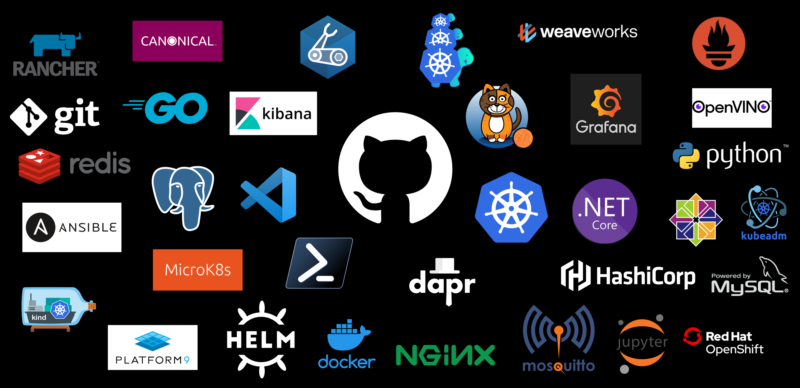

<!--p align="center">
    

<h2 align="center"> Hey There, I Am Adarsh Rajesh 👋 </h2>

<h3 align="center"> Developer 👨‍💻 | AI Researcher 🤖 | Finance Enthusiast 💸 </h3>
<!--  

  
  
 -->
  

<!--      -->
     
    <!-- img src="https://mir-s3-cdn-cf.behance.net/project_modules/max_1200/22b22287602523.5dbd29081561d.gif" width="400" / -->

    

    

    

  

### Connect with me

### 🔭 Languages and Tools: 

    

### 💻 Coding Platform

    
    

### 📈 GitHub Stats & Activity

<!-- p align="center">
    <a href="https://github.com/adarsh-rajesh">
        
        <!-- img height="180em" src="https://github-readme-stats.vercel.app/api/top-langs/?username=adarsh-rajesh&layout=compact&hide_border=false&border_color=A55CFF&title_color=A55CFF&text_color=F4F4F6&bg_color=090014&count_private=true&langs_count=8" alt="Top Languages"/ >
    </a>

    

 

<!-- Note: Activity Graph shows all contributions (including private). The GitHub Stats widget above displays public-only commit counts. -->

    

    <strong></> Keep coding 💻🚀 </></strong>

