<p align="center">
    
</p>
<h2 align="center"> Hey There, I Am Adarsh Rajesh 👋 </h2>

<h3 align="center"> Developer 👨‍💻 | AI Researcher 🤖 | Finance Enthusiast 💸 </h3>
<!--  <div align="center">
  
  </div> -->
  
<p align="center">
<!--      -->
     
     
<p align="center">
    
</p>

### Connect with me

[](https://www.linkedin.com/in/adarshrajesh/)
[](mailto:adarsh.rajesh6343@gmail.com)
[](https://www.instagram.com/_.adaxsh._/)
[](https://leetcode.com/u/adarsh-rajesh/)

### 🔭 Languages and Tools: 
<p align="center">
    
</p>

### 💻 Coding Platform
<p align="center">
    <a href="https://leetcode.com/u/adarsh-rajesh/" target="blank">
        
    </a>
    <a href="https://leetcode.com/u/adarsh-rajesh/" target="blank">
        
    </a>
</p>

### 📈 GitHub Stats & Activity

<p align="center">
    
    
</p>

<p align="center">
    
</p>

<p align="center">
 
</p>
<!-- Note: Activity Graph shows all contributions (including private). The GitHub Stats widget above displays public-only commit counts. -->


```
</> Keep coding 💻🚀 </>
```
